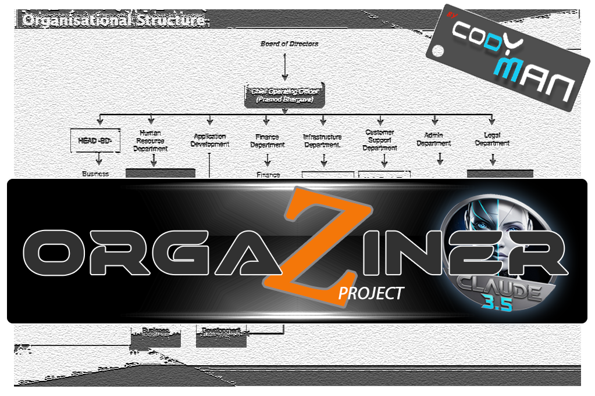
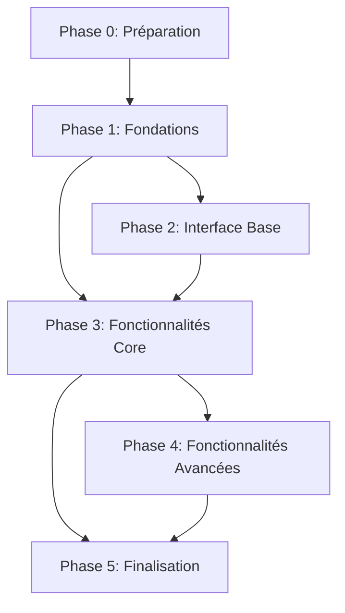

# OrgaZiner_Project V1

## Informations Projet
- Version : 1.0.0
- Statut : En développement
- Licence : MIT
- Dernière mise à jour : 2024-01-09

> [📝 Suivi du développement](SUIVI_DEVELOPPEMENT.md) | [📚 Template Documentation](README_TEMPLATE.md)

## Description
Application web de gestion des dépenses avec calendrier interactif et synchronisation familiale. Interface moderne et intuitive permettant une gestion simplifiée des finances personnelles et familiales.

## Fonctionnalités Principales

### Interface Calendrier
- Vue mensuelle interactive
- Affichage des dépenses par jour
- Informations enrichies (météo, rappels, notes)
- Modal de saisie rapide
- Mise à jour en temps réel

### Templates Pré-configurés
- Étudiant : Focus budget études et rappels cours
- Famille : Multi-comptes et budget partagé
- Entrepreneur : Séparation pro/perso
- Retraité : Interface simplifiée
- Voyageur : Multi-devises et notes

### Synchronisation Famille
- Connexion locale et web
- Partage via QR Code
- Configuration automatique
- Base de données embarquée (SQLite)

## Architecture Technique

### Base de Données
- SQLite embarquée
- Sauvegarde automatique
- Synchronisation locale
- Backup quotidien (7 jours de rétention)

#### Structure Base de Données
```sql
-- Tables Principales
Users (
    user_id INTEGER PRIMARY KEY,
    profile_type TEXT,
    settings JSON,
    created_at TIMESTAMP
)

Expenses (
    expense_id INTEGER PRIMARY KEY,
    user_id INTEGER,
    amount DECIMAL,
    category_id INTEGER,
    date DATE,
    description TEXT,
    tags JSON,
    FOREIGN KEY (user_id) REFERENCES Users(user_id)
)

Categories (
    category_id INTEGER PRIMARY KEY,
    name TEXT,
    parent_id INTEGER,
    color TEXT,
    icon TEXT
)

Templates (
    template_id INTEGER PRIMARY KEY,
    name TEXT,
    settings JSON,
    default_categories JSON
)

FamilyGroups (
    group_id INTEGER PRIMARY KEY,
    name TEXT,
    settings JSON,
    sync_key TEXT UNIQUE
)

-- Tables de Liaison
UserGroups (
    user_id INTEGER,
    group_id INTEGER,
    role TEXT,
    FOREIGN KEY (user_id) REFERENCES Users(user_id),
    FOREIGN KEY (group_id) REFERENCES FamilyGroups(group_id)
)
```

#### Indexes et Optimisations
```sql
CREATE INDEX idx_expenses_date ON Expenses(date);
CREATE INDEX idx_expenses_user ON Expenses(user_id);
CREATE INDEX idx_expenses_category ON Expenses(category_id);
CREATE INDEX idx_categories_parent ON Categories(parent_id);
CREATE UNIQUE INDEX idx_family_sync_key ON FamilyGroups(sync_key);
```

### Technologies et Stack

### Backend Node.js
```yaml
Core:
  - Node.js >= 16.0.0
  - Express.js >= 4.18.0
  - TypeScript >= 4.9.0

Database:
  - SQLite3 >= 5.1.0
  - Prisma ORM >= 4.0.0

Testing:
  - Jest >= 29.0.0
  - Supertest >= 6.0.0

Documentation:
  - JSDoc
  - Swagger/OpenAPI 3.0
```

### Outils de Développement
```yaml
IDE Recommandé:
  - VSCode avec extensions:
    * ESLint
    * Prettier
    * GitLens
    * Debug
    * SQLite Viewer

Qualité Code:
  - ESLint (config Airbnb)
  - Prettier
  - Husky (pre-commit hooks)
  - TypeScript strict mode

Performance:
  - Node.js profiler
  - Chrome DevTools
  - Lighthouse
```

### Scripts NPM
```bash
# Développement
npm run dev         # Lancer en mode développement
npm run build      # Build production
npm run start      # Lancer en production
npm run lint       # Vérifier le code
npm run format     # Formater le code

# Tests
npm run test       # Lancer tous les tests
npm run test:watch # Tests en mode watch
npm run test:cov   # Couverture des tests

# Documentation
npm run docs       # Générer la documentation
npm run docs:serve # Servir la documentation

# Base de données
npm run db:migrate # Exécuter les migrations
npm run db:seed    # Peupler la base de données
npm run db:reset   # Réinitialiser la base
```

### Structure du Projet Node.js
```
project/
├── src/
│   ├── api/              # Routes et contrôleurs
│   │   ├── expenses/     # Module dépenses
│   │   ├── users/        # Module utilisateurs
│   │   └── templates/    # Module templates
│   ├── config/          # Configuration
│   │   ├── database.ts
│   │   ├── logger.ts
│   │   └── server.ts
│   ├── models/          # Modèles Prisma
│   ├── services/        # Logique métier
│   ├── utils/           # Utilitaires
│   └── app.ts          # Point d'entrée
├── prisma/             # Schémas et migrations
├── tests/
│   ├── unit/
│   ├── integration/
│   └── e2e/
├── docs/              # Documentation
└── dist/             # Code compilé
```

### Standards de Développement

#### Système de Logs Détaillé
```yaml
Format Standard:
  Timestamp: [YYYY-MM-DD HH:mm:ss.mmm]
  Niveau: [NIVEAU]
  Module: [MODULE]
  Fonction: [FONCTION]
  Message: Description détaillée
  Context: {données JSON}

Niveaux de Log:
  ERROR:
    - Erreurs bloquantes
    - Exceptions non gérées
    - Échecs de synchronisation
    
  WARNING:
    - Tentatives échouées
    - Données incohérentes
    - Performance dégradée
    
  INFO:
    - Actions utilisateur
    - Changements d'état
    - Synchronisations réussies
    
  DEBUG:
    - Variables détaillées
    - Flux d'exécution
    - Données temporaires
    
  VALID:
    - Validations réussies
    - Tests passés
    - Migrations complétées

Rotation des Logs:
  - Rotation quotidienne
  - Compression après 7 jours
  - Archivage après 30 jours
  - Purge après 90 jours
```

#### Standards de Code
```yaml
Nommage:
  Variables:
    - camelCase
    - Préfixe selon type (str_, num_, bool_, arr_, obj_)
    - Noms explicites et en français
  
  Fonctions:
    - camelCase
    - Verbe_Nom (ex: obtenir_Utilisateur)
    - Documentation JSDoc obligatoire
  
  Classes:
    - PascalCase
    - Nom_Type (ex: Utilisateur_Manager)
    - Interface I_Nom (ex: I_Gestionnaire)

Documentation:
  Fonctions: |
    /**
     * @description Description en français
     * @param {Type} nom - Description
     * @returns {Type} Description
     * @throws {Error} Conditions d'erreur
     * @example
     * // Exemple d'utilisation
     */

  Classes: |
    /**
     * @class NomClasse
     * @description Description détaillée
     * @implements {Interface}
     * @property {Type} prop - Description
     */

Tests:
  Unitaires:
    - 1 fichier test par module
    - Nommage: [module].test.js
    - Coverage minimum 80%
  
  Intégration:
    - Scénarios complets
    - Données de test isolées
    - Environnement dédié
```

## Structure des Fichiers et Protection

### Structure des Dossiers
```
project/
├── logs/
│   ├── system/
│   │   ├── errors/
│   │   ├── warnings/
│   │   └── info/
│   └── user/
│       ├── actions/
│       ├── modifications/
│       └── sessions/
├── data/
│   ├── system/
│   │   ├── config/
│   │   ├── cache/
│   │   └── backup/
│   └── user/
│       ├── profiles/
│       ├── templates/
│       └── preferences/
└── src/
    └── [modules]/
```

### En-tête Protégée des Fichiers
```
/******************************************************************
 * !!! ATTENTION - LECTURE OBLIGATOIRE !!!
 * 
 * 1. SUIVI DÉVELOPPEMENT
 *    → OBLIGATOIRE : Mettre à jour SUIVI_DEVELOPPEMENT.md en temps réel
 *    → Localisation : [racine_projet]/SUIVI_DEVELOPPEMENT.md
 *    → Quand : Avant/Pendant/Après chaque modification
 *    → Pourquoi : Point de reprise, traçabilité, qualité
 * 
 * 2. LECTURE DOCUMENTATION
 *    → OBLIGATOIRE : Lire/Relire le README.md avant toute modification
 *    → OBLIGATOIRE : Lire et comprendre cette en-tête
 *    → Contient : Architecture, standards, processus
 *    → Crucial pour : Cohérence, qualité, maintenance
 * 
 * 3. VALIDATION REQUISE
 *    → README.md lu et compris
 *    → En-tête fichiers vérifiée
 *    → SUIVI_DEVELOPPEMENT.md à jour
 *    → Points de reprise notés
 * 
 * ⚠️ DÉVELOPPEMENT INVALIDE SI NON RESPECTÉ ⚠️
 * ⚠️ RELECTURE README.md OBLIGATOIRE À CHAQUE SESSION ⚠️
 ******************************************************************/
 
/*******************************************************************
 * [NOM_MODULE] - Version [X.Y.Z.W]
 * 
 * DESCRIPTION:
 * [Description détaillée du module]
 * 
 * FONCTIONS:
 * [1.0] - [Nom_Fonction_1] : [Description courte]
 * [1.1] - [Nom_Fonction_2] : [Description courte]
 * ...
 * 
 * DÉPENDANCES:
 * - [Module_1]
 * - [Module_2]
 * 
 * IMPACTS:
 * - [Impact_1] : [Description]
 * - [Impact_2] : [Description]
 * 
 * HISTORIQUE:
 * [Date] - [Version] : [Modification]
 * 
 * POINTS DE REPRISE:
 * → Dernier fichier: [chemin]
 * → Dernière fonction: [nom]
 * → Dernière ligne: [numéro]
 * 
 * VALIDATION DE SESSION:
 * □ README.md relu
 * □ En-tête comprise
 * □ SUIVI_DEVELOPPEMENT.md vérifié
 * □ Points de reprise validés
 * 
 * /!\ ZONE PROTÉGÉE - NE PAS MODIFIER /!\
 *******************************************************************/

### Validation Obligatoire En-tête
```yaml
Avant chaque session de développement:
1. Relire README.md complet ✓
2. Comprendre les standards ✓
3. Vérifier les mises à jour ✓

Avant toute modification:
1. Lire l'en-tête complète ✓
2. Comprendre les impacts ✓
3. Vérifier les dépendances ✓
4. Noter le point de reprise ✓
5. Mettre à jour SUIVI_DEVELOPPEMENT.md ✓

Pendant le développement:
1. Respecter la structure ✓
2. Documenter les changements ✓
3. Mettre à jour l'historique ✓
4. Actualiser les points de reprise ✓

Après les modifications:
1. Valider l'intégrité de l'en-tête ✓
2. Mettre à jour les versions ✓
3. Compléter SUIVI_DEVELOPPEMENT.md ✓
4. Vérifier cohérence avec README.md ✓
```

### Protection Technique
```yaml
Protection En-tête:
- Signature numérique
- Validation git hooks
- Blocage si modification
- Backup automatique

Validation Lecture:
- Checksum en-tête
- Log consultation README
- Timestamp validation
- Signature développeur
- Historique consultations

Validation Documentation:
- README.md checksum
- Log relecture README
- Fréquence consultation
- Points clés compris
```

## Suivi du Développement en Temps Réel

### Fichier de Suivi Principal
Le fichier `SUIVI_DEVELOPPEMENT.md` à la racine du projet est **OBLIGATOIRE** et doit être utilisé en temps réel pendant tout le développement.

#### Importance Critique
- 🔴 **OBLIGATOIRE** : Mise à jour en temps réel pendant le développement
- 🔄 Sert de point de reprise après chaque interruption
- 📝 Historique précis des modifications et erreurs
- 🎯 Traçabilité complète du développement

#### Quand Mettre à Jour
1. **En Début de Session**
   - Vérifier le dernier point de reprise
   - Valider l'état des tâches en cours
   - Noter la reprise du développement

2. **Pendant le Développement**
   - À chaque changement de fichier
   - À chaque nouvelle fonction
   - À chaque erreur rencontrée
   - À chaque solution trouvée

3. **Avant Chaque Pause**
   - Noter le point exact d'arrêt
   - Décrire l'état des modifications
   - Lister les points en suspens

4. **En Fin de Session**
   - Résumer les modifications
   - Noter les points de reprise
   - Mettre à jour les métriques

#### Comment Utiliser
```yaml
1. Avant de Coder:
   - Ouvrir SUIVI_DEVELOPPEMENT.md
   - Vérifier le dernier état
   - Mettre à jour la section "Travail en Cours"

2. Pendant le Codage:
   - Garder le fichier ouvert
   - Noter les modifications importantes
   - Documenter les erreurs immédiatement

3. Après Chaque Modification:
   - Mettre à jour la progression
   - Noter les points de reprise
   - Documenter les décisions
```

#### Avantages
- 🔍 Reprise immédiate après interruption
- 📊 Suivi précis de la progression
- 🐛 Traçabilité des bugs et solutions
- 📈 Mesure de la qualité du développement

#### Automatisation
- Git hooks pour mises à jour automatiques
- Scripts de validation de suivi
- Alertes si suivi incomplet
- Métriques automatiques

⚠️ **ATTENTION** : Un développement sans mise à jour du suivi sera considéré comme incomplet et devra être repris depuis le dernier point documenté.

## Chronologie de Développement Optimisée

### Phase 0 : Préparation (0.0.0.0)
1. **Configuration Environnement**
   - Git et .gitignore
   - Structure des dossiers
   - Création README initial
   - Configuration IDE

2. **Mise en Place Protection**
   - Structure en-têtes
   - Git hooks protection
   - Système de logs
   - Points de sauvegarde

3. **Configuration Base**
   - Node.js et npm
   - ESLint et Prettier
   - Jest pour tests
   - Documentation automatique

### Phase 1 : Fondations (1.0.0.0)
1. **Base de Données**
   - Schema SQLite
   - Migration système
   - Tests unitaires DB
   - Documentation DB

2. **Architecture Core**
   - MVC setup
   - Router base
   - Controllers base
   - Services base

3. **Système de Logs**
   - Logger système
   - Logger utilisateur
   - Rotation logs
   - Monitoring

4. **Gestion Erreurs**
   - Handlers globaux
   - Messages utilisateur
   - Recovery système
   - Documentation erreurs

### Phase 2 : Interface Base (2.0.0.0)
1. **Structure UI**
   - Layout principal
   - Composants base
   - Thèmes système
   - Grid système

2. **Calendrier Core**
   - Grille base
   - Navigation mois
   - Sélection dates
   - Events base

3. **Composants Réutilisables**
   - Boutons
   - Forms
   - Modals
   - Alerts

4. **Responsive Design**
   - Breakpoints
   - Media queries
   - Mobile first
   - Tests devices

### Phase 3 : Fonctionnalités Core (3.0.0.0)
1. **Gestion Utilisateurs**
   - Profils base
   - Préférences
   - Sessions
   - Sécurité

2. **Gestion Dépenses**
   - CRUD base
   - Validation
   - Catégories
   - Calculs

3. **Templates**
   - Structure base
   - 5 profils type
   - Customisation
   - Import/Export

4. **Internationalisation**
   - i18n setup
   - FR/EN base
   - Messages système
   - Documentation

### Phase 4 : Fonctionnalités Avancées (4.0.0.0)
1. **Calendrier Avancé**
   - Multi-events
   - Drag & drop
   - Filtres
   - Recherche

2. **Gestion Famille**
   - Connexions locales
   - Partage données
   - Permissions
   - Synchronisation

3. **Rapports & Analytics**
   - Graphiques base
   - Exports données
   - Statistiques
   - Prévisions

4. **Automatisations**
   - Rappels
   - Sauvegardes
   - Notifications
   - Tâches planifiées

### Phase 5 : Finalisation (5.0.0.0)
1. **Tests Complets**
   - Tests unitaires
   - Tests intégration
   - Tests UI
   - Tests charge

2. **Documentation**
   - Guide technique
   - Guide utilisateur
   - API docs
   - Vidéos tuto

3. **Optimisation**
   - Performance
   - Sécurité
   - Cache
   - Compression

4. **Déploiement**
   - Beta test
   - Corrections
   - Release v1.0
   - Support initial

### Points de Validation par Phase
```markdown
# Validation Phase [X.0.0.0]

## 1. Validation Technique
[ ] Tests automatisés OK
[ ] Performance validée
[ ] Sécurité vérifiée
[ ] Logs propres

## 2. Validation Architecture
[ ] Structure respectée
[ ] Conventions suivies
[ ] Documentation complète
[ ] Code review OK

## 3. Validation Fonctionnelle
[ ] Features testées
[ ] UI/UX validée
[ ] Feedback intégré
[ ] Cas limites OK

## 4. Validation Utilisateur
[ ] Demo réalisée
[ ] Retours traités
[ ] Formation faite
[ ] Sign-off obtenu

## 5. Préparation Phase Suivante
[ ] Dépendances identifiées
[ ] Risques évalués
[ ] Ressources prêtes
[ ] Planning validé

Validé par: ____________
Date: ____________
Version: ____________
```

### Dépendances Critiques


### Points de Contrôle
- Chaque phase requiert validation complète
- Pas de passage à la phase suivante sans validation
- Documentation obligatoire à chaque étape
- Tests complets avant validation
- Revue de code systématique

## Système de Validation et Logs

### 1. Validation des Étapes
#### 1.1 Points de Validation Obligatoires
- Chaque étape nécessite une validation utilisateur
- Validation technique (tests)
- Validation fonctionnelle (usage)
- Validation documentation

#### 1.2 Processus de Validation
```markdown
# Validation Étape [X.Y.Z]

## 1. Vérification Technique
[ ] Tests unitaires passés
[ ] Tests d'intégration passés
[ ] Pas d'erreurs dans les logs
[ ] Performance validée

## 2. Vérification Fonctionnelle
[ ] Fonctionnalités testées
[ ] Interface utilisateur validée
[ ] Cas d'erreur gérés
[ ] Feedback utilisateur implémenté

## 3. Documentation
[ ] Documentation mise à jour
[ ] Commentaires code à jour
[ ] README mis à jour
[ ] Changelog complété

## 4. Validation Utilisateur
[ ] Démonstration effectuée
[ ] Retours utilisateur traités
[ ] Approbation obtenue

Signature Validateur: ________________
Date: ________________
```

### 2. Système de Logs

#### 2.1 Logs Système (/logs/system/)
- **Errors/**
  ```
  [TIMESTAMP]_[MODULE]_[ERROR_CODE].log
  - Stack trace
  - État système
  - Variables impliquées
  ```
- **Warnings/**
  ```
  [TIMESTAMP]_[MODULE]_[WARN_CODE].log
  - Description
  - Impact potentiel
  - Recommandations
  ```
- **Info/**
  ```
  [TIMESTAMP]_[MODULE]_[INFO_CODE].log
  - État système
  - Performances
  - Statistiques
  ```

#### 2.2 Logs Utilisateur (/logs/user/)
- **Actions/**
  ```
  [TIMESTAMP]_[USER_ID]_[ACTION].log
  - Action effectuée
  - Paramètres
  - Résultat
  ```
- **Modifications/**
  ```
  [TIMESTAMP]_[USER_ID]_[MODIFICATION].log
  - Changements effectués
  - État avant/après
  - Raison
  ```
- **Sessions/**
  ```
  [TIMESTAMP]_[USER_ID]_session.log
  - Début/Fin session
  - Actions principales
  - Performances
  ```

### 3. Protection des Données

#### 3.1 Données Système (/data/system/)
- **Config/**
  * Paramètres système
  * Variables d'environnement
  * Configuration sécurité
- **Cache/**
  * Cache temporaire
  * Données de session
  * Optimisations
- **Backup/**
  * Sauvegardes système
  * Points de restauration
  * Archives configuration

#### 3.2 Données Utilisateur (/data/user/)
- **Profiles/**
  * Informations utilisateur
  * Préférences
  * Historique
- **Templates/**
  * Modèles personnalisés
  * Configurations sauvegardées
  * Présets
- **Preferences/**
  * Configuration interface
  * Paramètres personnalisés
  * Raccourcis

### 4. Protection du Code
- En-têtes protégées par convention de nommage spéciale
- Validation git-hooks pour en-têtes
- Backup automatique avant modification
- Système de restauration rapide
- Vérification intégrité en-têtes

## Processus de Développement

### Cycle de Développement
```yaml
Phases:
  1. Préparation:
    - Lecture README.md
    - Vérification points de reprise
    - Mise à jour SUIVI_DEVELOPPEMENT.md
  
  2. Développement:
    - Respect standards de code
    - Documentation en temps réel
    - Tests unitaires systématiques
  
  3. Validation:
    - Tests automatisés
    - Revue de code
    - Vérification documentation
  
  4. Déploiement:
    - Backup pré-déploiement
    - Migration données
    - Tests post-déploiement

Contrôles Qualité:
  Automatiques:
    - Linting (ESLint)
    - Tests unitaires (Jest)
    - Coverage (min 80%)
    - Validation types (TypeScript)
  
  Manuels:
    - Revue documentation
    - Tests utilisateur
    - Validation fonctionnelle
```

### Points de Contrôle Critiques
```yaml
Avant Développement:
  Documentation:
    - ✓ README.md lu et compris
    - ✓ En-tête fichiers vérifiée
    - ✓ SUIVI_DEVELOPPEMENT.md à jour
  
  Environnement:
    - ✓ Branches Git propres
    - ✓ Dépendances à jour
    - ✓ Tests passants

Pendant Développement:
  Code:
    - ✓ Standards respectés
    - ✓ Tests unitaires écrits
    - ✓ Documentation mise à jour
  
  Validation:
    - ✓ Pas de régressions
    - ✓ Performance stable
    - ✓ Sécurité maintenue

Après Développement:
  Revue:
    - ✓ Code documenté
    - ✓ Tests complets
    - ✓ Performances validées
  
  Déploiement:
    - ✓ Backup effectué
    - ✓ Migration testée
    - ✓ Rollback préparé
```

### Métriques de Qualité
```yaml
Code:
  Couverture Tests: ≥ 80%
  Complexité Cyclomatique: ≤ 10
  Dette Technique: ≤ 5%
  Duplication: ≤ 3%

Performance:
  Temps Réponse: ≤ 200ms
  Utilisation CPU: ≤ 30%
  Utilisation Mémoire: ≤ 100MB
  Taille Bundle: ≤ 500KB

Documentation:
  Complétude: 100%
  Mise à Jour: < 7 jours
  Clarté: Score > 8/10
  Exemples: ≥ 1 par fonction
```

### Plan de Reprise
```yaml
Points de Sauvegarde:
  Fréquence:
    - Code: Commit par fonctionnalité
    - Base de données: Toutes les 6h
    - Configuration: Quotidienne
  
  Rétention:
    - Code: Illimitée
    - Base de données: 30 jours
    - Logs: 90 jours

Procédures Restauration:
  1. Analyse Incident:
    - Identification cause
    - Évaluation impact
    - Choix point restauration
  
  2. Restauration:
    - Code: git checkout
    - Base de données: restore
    - Configuration: reload
  
  3. Validation:
    - Tests automatiques
    - Vérification données
    - Contrôle intégrité
```

## Installation

### Prérequis
- Node.js
- SQLite
- Navigateur moderne
- Réseau local

### Configuration
1. Clone repository
2. Install dependencies
3. Configure database
4. Setup network

## Support
- Documentation utilisateur
- Guide technique
- FAQ

### Internationalisation
```yaml
Configuration i18next:
  Langues:
    - Français (default)
    - Anglais
    - Espagnol (prévu)
  
  Structure:
    /locales/
      ├── fr/
      │   ├── common.json     # Textes génériques
      │   ├── expenses.json   # Gestion dépenses
      │   ├── calendar.json   # Interface calendrier
      │   └── errors.json     # Messages d'erreur
      └── en/
          └── [même structure]

  Implémentation:
    - Détection automatique langue navigateur
    - Stockage préférence utilisateur
    - Fallback vers français
    - Chargement dynamique des traductions

  Sélecteur de Langue:
    Position: Coin supérieur gauche
    Style: Menu déroulant avec drapeaux
    Persistance: Local storage
```

### Gestion des Templates

#### Template Étudiant
```yaml
Configuration:
  Budget:
    - Catégories études prédéfinies
    - Alertes bourses/échéances
    - Suivi dépenses par semestre
  
  Calendrier:
    - Intégration emploi du temps
    - Rappels examens/devoirs
    - Périodes de stage

  Statistiques:
    - Répartition dépenses études/vie
    - Comparaison mensuelle
    - Projection annuelle
```

#### Template Famille
```yaml
Configuration:
  Comptes:
    - Multi-utilisateurs
    - Rôles personnalisables
    - Partage dépenses
  
  Budget:
    - Dépenses communes/individuelles
    - Répartition automatique
    - Plafonds par catégorie
  
  Planification:
    - Événements familiaux
    - Dépenses récurrentes
    - Objectifs d'épargne
```

#### Template Entrepreneur
```yaml
Configuration:
  Séparation:
    - Comptes pro/perso distincts
    - TVA automatique
    - Export comptable
  
  Analyses:
    - Tableaux de bord
    - Prévisions trésorerie
    - KPIs personnalisables
  
  Documents:
    - Scan factures
    - Classification auto
    - Archivage légal
```

### Sécurité et Protection

#### Chiffrement
```yaml
Données Sensibles:
  - Chiffrement AES-256
  - Clés uniques par famille
  - Rotation des clés mensuelle

Stockage Local:
  - Encryption base de données
  - Protection fichiers config
  - Sauvegarde chiffrée

Synchronisation:
  - Protocole sécurisé
  - Vérification intégrité
  - Double authentification
```

#### Audit et Traçabilité
```yaml
Journalisation:
  Actions:
    - Modifications données
    - Connexions/déconnexions
    - Synchronisations
    - Exports/imports
  
  Rétention:
    - Logs système: 90 jours
    - Logs sécurité: 1 an
    - Logs audit: 5 ans

  Alertes:
    - Tentatives suspectes
    - Modifications massives
    - Erreurs répétées
```

## Gestion des Versions et Sauvegardes

### Système de Numérotation
- **Format**: `[PHASE].[ETAPE].[SOUS-ETAPE].[REVISION]`
  * PHASE : Numéro de la phase principale (1-5)
  * ETAPE : Numéro de l'étape dans la phase (1-9)
  * SOUS-ETAPE : Numéro de la sous-étape (1-9)
  * REVISION : Numéro de révision (1-99)

Exemple : Version `2.3.4.12`
- Phase 2 (Fonctionnalités Core)
- Étape 3 (Templates)
- Sous-étape 4 (Personnalisation)
- Révision 12

### 1. Version 1.0 - Archive Complète (1.0.0.0)
   - Snapshot complet du projet
   - Structure complète des dossiers
   - Tous les fichiers sources
   - Documentation initiale
   - Tests de base
   - Configuration initiale

### 2. Sauvegardes Incrémentielles
   #### 2.1 Par Commit
     * Uniquement fichiers modifiés
     * Message commit détaillé avec numéro de version
     * Liste des dépendances impactées
     * Tests associés
     * Rapport de modification obligatoire

   #### 2.2 Par Module
     * Sauvegarde par fonctionnalité
     * Tests unitaires liés
     * Documentation mise à jour
     * Fichiers de configuration modifiés
     * Rapport d'évolution du module

### 3. Rapports de Version
   #### 3.1 Structure du Rapport
   ```markdown
   # Rapport Version [X.Y.Z.W]
   
   ## 1. Informations Générales
   - Date :
   - Auteur :
   - Temps de développement :
   - État : [En cours/Terminé/En test]
   
   ## 2. Modifications
   - Liste des fichiers modifiés
   - Impact sur les autres modules
   - Nouvelles dépendances
   
   ## 3. Tests
   - Tests effectués
   - Résultats
   - Couverture
   
   ## 4. Documentation
   - Mises à jour effectuées
   - Nouveaux documents
   
   ## 5. Validation
   - Points validés
   - Points en attente
   - Problèmes connus
   
   ## 6. Prochaines Étapes
   - Tâches restantes
   - Dépendances à résoudre
   ```

### 4. Points de Sauvegarde Critiques
   - Fin de phase majeure (X.0.0.0)
   - Validation fonctionnalité (X.Y.0.0)
   - Correction bug critique (X.Y.Z.W)
   - Migration base de données
   - Changement architecture

### 5. Structure des Commits
   ```
   [TYPE]_[VERSION X.Y.Z.W]_[MODULE] : Description courte
   
   - Détail des modifications
   - Impact sur autres modules
   - Tests effectués
   - Validation requise
   - Lien vers le rapport complet
   ```

### 6. Types de Commits
   - FEAT_[VERSION] : Nouvelle fonctionnalité
   - FIX_[VERSION] : Correction de bug
   - DOCS_[VERSION] : Documentation
   - STYLE_[VERSION] : Mise en forme
   - REFACTOR_[VERSION] : Restructuration
   - TEST_[VERSION] : Ajout/modification tests
   - PERF_[VERSION] : Optimisation

### 7. Stratégie de Branches
   - main : Versions stables (X.0.0.0)
   - develop : Développement (X.Y.0.0)
   - feature/* : Nouvelles fonctionnalités (X.Y.Z.0)
   - hotfix/* : Corrections urgentes (X.Y.Z.W)
   - release/* : Préparation version

### 8. Validation et Restauration
   #### 8.1 Validation
   - Tests automatisés pour la version
   - Vérification intégrité
   - Documentation à jour
   - Review code
   - Rapport de validation

   #### 8.2 Restauration
   - Points de restauration par version
   - Procédure rollback documentée
   - Tests post-restauration
   - Validation données
   - Rapport d'incident/restauration

## Validations des Propositions

### Interface Validée
1. **Vue Calendrier**
   - Calendrier mensuel en vue principale ✓
   - Affichage moderne et enrichi ✓
   - Cases avec infos multiples :
     * Dépenses du jour
     * Météo
     * Rappels
     * Actualités
     * Aide-mémoire
     * Alarmes

2. **Panneau Statistiques**
   - Position : coin supérieur ✓
   - Affichage en temps réel ✓
   - Informations :
     * Total initial
     * Solde restant
     * Nombre de dépenses

### Fonctionnalités Validées
1. **Affichage Principal** ✓
   - Vue mensuelle par défaut
   - Options vues alternatives
   - Mode jour/nuit automatique

2. **Informations par Case** ✓
   - Montants et statistiques
   - Intégration météo
   - Système de rappels
   - Indicateurs visuels

3. **Système de Rappels** ✓
   - Gestion complète
   - Notifications
   - Récurrence

4. **Météo** ✓
   - Prévisions intégrées
   - Alertes
   - Indices détaillés

5. **Actualités** ✓
   - Flux personnalisé
   - Actualités locales
   - Événements

6. **Gestion des Dépenses** ✓
   - Saisie intuitive
   - Catégorisation
   - Suivi photos

7. **Statistiques** ✓
   - Tableaux de bord
   - Graphiques
   - Exports

### Personnalisation Validée
- **Templates Pré-configurés** ✓
  * Étudiant
  * Famille
  * Entrepreneur
  * Retraité
  * Voyageur

### Paramètres Système Validés
1. **Profil Simple** ✓
   - Nom
   - Email
   - Template
   - Devise

2. **Affichage** ✓
   - Mode Jour/Nuit
   - Taille texte
   - Masquage montants

3. **Notifications** ✓
   - Configuration simple
   - 3 niveaux (Tout/Important/Aucun)

4. **Données** ✓
   - Sauvegarde auto
   - Export simple
   - Nettoyage

5. **Aide** ✓
   - Guide rapide
   - Support
   - À propos

### Réseau et Synchronisation Validés
1. **Base de Données** ✓
   - SQLite embarquée
   - Sauvegarde automatique
   - Pas de cloud

2. **Configuration Famille** ✓
   - Premier utilisateur = Admin
   - Clé famille unique
   - QR Code ou code 12 caractères
   - Lien d'invitation

3. **Modes de Connexion** ✓
   - Local (réseau domestique)
   - Web (externe)
   - Basculement automatique

### Internationalisation Validée
1. **Système i18next** ✓
   - Français par défaut
   - Anglais disponible
   - Structure modulaire

2. **Sélecteur de Langue** ✓
   - Position : coin supérieur gauche
   - Format : boutons avec drapeaux
   - Style visuel unique

## Gestion des Versions et Sauvegardes

### Système de Numérotation
- **Format**: `[PHASE].[ETAPE].[SOUS-ETAPE].[REVISION]`
  * PHASE : Numéro de la phase principale (1-5)
  * ETAPE : Numéro de l'étape dans la phase (1-9)
  * SOUS-ETAPE : Numéro de la sous-étape (1-9)
  * REVISION : Numéro de révision (1-99)

Exemple : Version `2.3.4.12`
- Phase 2 (Fonctionnalités Core)
- Étape 3 (Templates)
- Sous-étape 4 (Personnalisation)
- Révision 12

### 1. Version 1.0 - Archive Complète (1.0.0.0)
   - Snapshot complet du projet
   - Structure complète des dossiers
   - Tous les fichiers sources
   - Documentation initiale
   - Tests de base
   - Configuration initiale

### 2. Sauvegardes Incrémentielles
   #### 2.1 Par Commit
     * Uniquement fichiers modifiés
     * Message commit détaillé avec numéro de version
     * Liste des dépendances impactées
     * Tests associés
     * Rapport de modification obligatoire

   #### 2.2 Par Module
     * Sauvegarde par fonctionnalité
     * Tests unitaires liés
     * Documentation mise à jour
     * Fichiers de configuration modifiés
     * Rapport d'évolution du module

### 3. Rapports de Version
   #### 3.1 Structure du Rapport
   ```markdown
   # Rapport Version [X.Y.Z.W]
   
   ## 1. Informations Générales
   - Date :
   - Auteur :
   - Temps de développement :
   - État : [En cours/Terminé/En test]
   
   ## 2. Modifications
   - Liste des fichiers modifiés
   - Impact sur les autres modules
   - Nouvelles dépendances
   
   ## 3. Tests
   - Tests effectués
   - Résultats
   - Couverture
   
   ## 4. Documentation
   - Mises à jour effectuées
   - Nouveaux documents
   
   ## 5. Validation
   - Points validés
   - Points en attente
   - Problèmes connus
   
   ## 6. Prochaines Étapes
   - Tâches restantes
   - Dépendances à résoudre
   ```

### 4. Points de Sauvegarde Critiques
   - Fin de phase majeure (X.0.0.0)
   - Validation fonctionnalité (X.Y.0.0)
   - Correction bug critique (X.Y.Z.W)
   - Migration base de données
   - Changement architecture

### 5. Structure des Commits
   ```
   [TYPE]_[VERSION X.Y.Z.W]_[MODULE] : Description courte
   
   - Détail des modifications
   - Impact sur autres modules
   - Tests effectués
   - Validation requise
   - Lien vers le rapport complet
   ```

### 6. Types de Commits
   - FEAT_[VERSION] : Nouvelle fonctionnalité
   - FIX_[VERSION] : Correction de bug
   - DOCS_[VERSION] : Documentation
   - STYLE_[VERSION] : Mise en forme
   - REFACTOR_[VERSION] : Restructuration
   - TEST_[VERSION] : Ajout/modification tests
   - PERF_[VERSION] : Optimisation

### 7. Stratégie de Branches
   - main : Versions stables (X.0.0.0)
   - develop : Développement (X.Y.0.0)
   - feature/* : Nouvelles fonctionnalités (X.Y.Z.0)
   - hotfix/* : Corrections urgentes (X.Y.Z.W)
   - release/* : Préparation version

### 8. Validation et Restauration
   #### 8.1 Validation
   - Tests automatisés pour la version
   - Vérification intégrité
   - Documentation à jour
   - Review code
   - Rapport de validation

   #### 8.2 Restauration
   - Points de restauration par version
   - Procédure rollback documentée
   - Tests post-restauration
   - Validation données
   - Rapport d'incident/restauration
